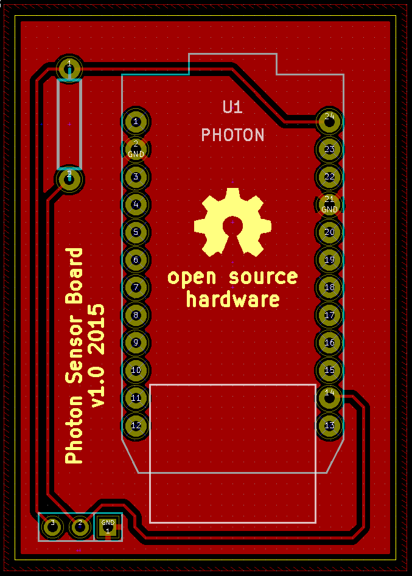

# Photon Sensor Board

A board to easily connect a Particle Photon with a DS18B20 temparature sensor.

The ``particle-boards`` library can be found here:
https://github.com/coredump-ch/kicad-particle

## Screenshot

## License

MIT
