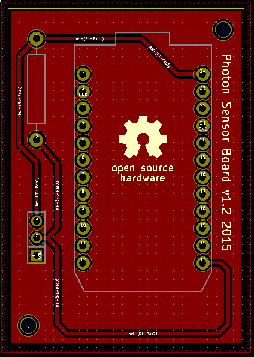

# Photon Sensor Board

A board to easily connect a Particle Photon with a DS18B20 temparature sensor.

The ``particle-boards`` library can be found here:
https://github.com/coredump-ch/kicad-particle

**Order here:**

- [DirtyPCBs](http://dirtypcbs.com/view.php?share=14221&accesskey=f6b3ffa6a66b2c59bf8eb13904b6e816)

## Screenshot

## PCB

Poorly self etched PCB:

## License

MIT
